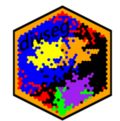

<!-- README.md is generated from README.Rmd. Please edit that file -->

# divseg <a href='https://christopherkenny.github.io/divseg/'></a>

<!-- badges: start -->

[](https://github.com/christopherkenny/divseg/actions)
<!-- badges: end -->

`divseg` implements common measures of diversity (within-geography) and
segregation (across-geographies).

## Installation

<!---
You can install the released version of divseg from [CRAN](https://CRAN.R-project.org) with:

``` r
install.packages("divseg")
```
-->

You can install the released version of divseg from
[GitHub](https://github.com/christopherkenny/divseg/) with:

``` r
remotes::install_github("christopherkenny/divseg")
```

## Example

The basic workflow relies on a `tibble` where each row represents a
geography and has columns that represent some form of population data.

``` r
library(divseg)
#> 
#> Attaching package: 'divseg'
#> The following object is masked from 'package:base':
#> 
#>     interaction
```

`divseg` comes with two example datasets. `de_county` contains 2010
Census data on the counties in Delaware. `de_tract` likewise has 2010
Census data on the tracts in Delaware.

``` r
data('de_county')
data('de_tract')
```

A pretty standard function call returns a vector, where the first entry
is a `tibble` and the second is `tidyselect` language.

``` r
ds_blau(.data = de_county, .cols = starts_with('pop_')) 
#> [1] 0.5155228 0.5570435 0.4052769
```

More importantly, if you specify an argument to `.name`, all functions
are pipe-able.

``` r
de_county %>% 
  ds_blau(starts_with('pop_'), .name = 'blau') %>% 
  ds_delta(starts_with('pop_'), .name = 'delta') %>% 
  dplyr::relocate(blau, delta)
#> Simple feature collection with 3 features and 22 fields
#> Geometry type: MULTIPOLYGON
#> Dimension:     XY
#> Bounding box:  xmin: -75.78866 ymin: 38.45101 xmax: -75.04894 ymax: 39.83901
#> Geodetic CRS:  NAD83
#> # A tibble: 3 x 23
#>    blau delta GEOID NAME     pop pop_white pop_black pop_hisp pop_aian pop_asian
#>   <dbl> <dbl> <chr> <chr>  <dbl>     <dbl>     <dbl>    <dbl>    <dbl>     <dbl>
#> 1 0.516 0.345 10001 Kent~ 162310    105891     37812     9346      916      3266
#> 2 0.557 0.345 10003 New ~ 538479    331836    124426    46921      984     23132
#> 3 0.405 0.345 10005 Suss~ 197145    149025     24544    16954      924      1910
#> # ... with 13 more variables: pop_nhpi <dbl>, pop_other <dbl>, pop_two <dbl>,
#> #   vap <dbl>, vap_white <dbl>, vap_black <dbl>, vap_hisp <dbl>,
#> #   vap_aian <dbl>, vap_asian <dbl>, vap_nhpi <dbl>, vap_other <dbl>,
#> #   vap_two <dbl>, geometry <MULTIPOLYGON [°]>
```

Each function has a partner that can go inside calls to
`dplyr::mutate()` by dropping the `ds_` prefix:

``` r
de_county %>% 
  dplyr::mutate(herf = hhi(starts_with('pop_'))) %>% 
  dplyr::relocate(herf)
#> Simple feature collection with 3 features and 21 fields
#> Geometry type: MULTIPOLYGON
#> Dimension:     XY
#> Bounding box:  xmin: -75.78866 ymin: 38.45101 xmax: -75.04894 ymax: 39.83901
#> Geodetic CRS:  NAD83
#> # A tibble: 3 x 22
#>    herf GEOID NAME           pop pop_white pop_black pop_hisp pop_aian pop_asian
#>   <dbl> <chr> <chr>        <dbl>     <dbl>     <dbl>    <dbl>    <dbl>     <dbl>
#> 1 0.484 10001 Kent Count~ 162310    105891     37812     9346      916      3266
#> 2 0.443 10003 New Castle~ 538479    331836    124426    46921      984     23132
#> 3 0.595 10005 Sussex Cou~ 197145    149025     24544    16954      924      1910
#> # ... with 13 more variables: pop_nhpi <dbl>, pop_other <dbl>, pop_two <dbl>,
#> #   vap <dbl>, vap_white <dbl>, vap_black <dbl>, vap_hisp <dbl>,
#> #   vap_aian <dbl>, vap_asian <dbl>, vap_nhpi <dbl>, vap_other <dbl>,
#> #   vap_two <dbl>, geometry <MULTIPOLYGON [°]>
```
